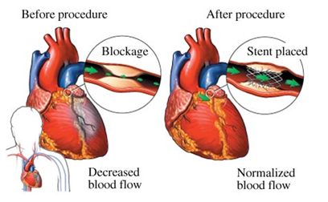

.. _sphx_glr_ex_25-tecstent.rst:

.. _tech_demo_25:

Cardiovascular Stent Simulation
===============================

This example problem shows how to simulate stent-artery interaction during and after stent
placement in an occluded artery.
The analysis exposes advanced modeling techniques using PyMAPDL such as:
* Contact
* Element birth and death
* Mixed u-P formulation
* Nonlinear stabilization

The following topics are available:

*  `25.1. Introduction`_
*  `25.2. Setting up the model`_
*  `25.3. Analysis`_
*  `25.4. Solution of the model`_
*  `25.5. Results`_
*  `25.6. Exit MAPDL`_
*  `25.7. Input files`_

This example is inspired from the model and analysis defined in Chapter 25 of the `Mechanical
APDL Technology Showcase Manual <mapdl_tech_show_>`_.

25.1. Introduction
------------------

25.1.1. Problem description
^^^^^^^^^^^^^^^^^^^^^^^^^^^

A bare metal stent is an effective device for opening atherosclerotic arteries and
other blockages:

    
    **Figure 25.1: Effect of Stent Placement in Increasing Blood Flow**
    Courtesy of `LakeviewCenter <http://www.elakeviewcenter.org>`

The success of stenting depends largely on how the stent and the artery interact
mechanically. In both the stent-design process and in pre-clinical patient-specific
evaluations, computer simulation using finite element analysis (FEA) has become an
accepted tool for studying stent-artery interaction. 

A viable stent-artery finite element model must properly reflect the nonlinear nature
of the phenomenon, such as the biological tissue properties, large arterial wall
deformation, and the sliding contact between the stent and the artery wall.

25.1.2. Starting MAPDL as a service
^^^^^^^^^^^^^^^^^^^^^^^^^^^^^^^^^^^

.. code:: ipython3

   # starting MAPDL as a service and importing an external model
   from ansys.mapdl.core import launch_mapdl
   
   # start MAPDL as a service
   mapdl = launch_mapdl()
   print(mapdl)

25.2. Setting up the model
--------------------------

First, we define the material properties. 

.. code:: ipython3

   # define 316L Stainless steel
   mapdl.prep7()
   mapdl.mptemp()
   mapdl.mptemp(sloc="1", t1="0")
   mapdl.mpdata(lab="EX", mat="1", c1="200e3")
   mapdl.mpdata(lab="PRXY", mat="1", c1="0.3")
   mapdl.mptemp()
   mapdl.mptemp(sloc="1", t1="0")
   mapdl.mpdata(lab="DENS", mat="1", c1="8000e-9")

Then, we can define the elements.

.. code:: ipython3

   # for straight line segments
   mapdl.et(itype="1", ename="beam189")
   mapdl.sectype(secid="1", type_="beam", subtype="csolid")
   mapdl.secdata(val1=0.05)

   # for arcs
   mapdl.et(itype="2", ename="beam189")
   mapdl.sectype(secid="2", type_="beam", subtype="csolid")
   mapdl.secdata(val1=0.05)

We define the 5-parameter Mooney-Rivlin hyperelastic artery material
model.

.. code:: ipython3

   c10 = 18.90e-3
   c01 = 2.75e-3
   c20 = 590.43e-3
   c11 = 857.2e-3
   nu1 = 0.49
   dd = 2 * (1 - 2 * nu1) / (c10 + c01)

   mapdl.tb(lab="hyper", mat="2", npts="5", tbopt="mooney")
   mapdl.tbdata(stloc="1", c1="c10", c2="c01", c3="c20", c4="c11", c6="dd")

We define the linear elastic material model for stiff calcified plaque.

.. code:: ipython3

   mapdl.mp(lab="EX", mat="3", c0=".00219e3")
   mapdl.mp(lab="NUXY", mat="3", c0="0.49")

We define the Solid185 element type to mesh both the artery and plaque.

.. code:: ipython3

   # for artery
   mapdl.et(itype="9", ename="SOLID185")
   mapdl.keyopt(
       itype="9", knum="6", value="1")  # Use mixed u-P formulation to avoid locking
   mapdl.keyopt(itype="9", knum="2", value="3")  # Use Simplified Enhanced Strain method

   # for plaque
   mapdl.et(itype="16", ename="SOLID185")
   mapdl.keyopt(itype="16", knum="2", value="0")  # Use B-bar

We define the settings to model the stent, the artery and the plaque.

We use force-distributed boundary constraints on 2 sides of artery wall to allow
for radial expansion of tissue without rigid body motion.

Settings for MPC Surface-based, force-distributed contact on proximal plane
parallel to x-y plane

.. code:: ipython3

   mapdl.mat("2")
   mapdl.r(nset="3")
   mapdl.real(nset="3")
   mapdl.et(itype="3", ename="170")
   mapdl.et(itype="4", ename="174")
   mapdl.keyopt(itype="4", knum="12", value="5")
   mapdl.keyopt(itype="4", knum="4", value="1")
   mapdl.keyopt(itype="4", knum="2", value="2")
   mapdl.keyopt(itype="3", knum="2", value="1")
   mapdl.keyopt(itype="3", knum="4", value="111111")
   mapdl.type(itype="3")

   mapdl.mat("2")
   mapdl.r(nset="4")
   mapdl.real(nset="4")
   mapdl.et(itype="5", ename="170")
   mapdl.et(itype="6", ename="174")
   mapdl.keyopt(itype="6", knum="12", value="5")
   mapdl.keyopt(itype="6", knum="4", value="1")
   mapdl.keyopt(itype="6", knum="2", value="2")
   mapdl.keyopt(itype="5", knum="2", value="1")
   mapdl.keyopt(itype="5", knum="4", value="111111")
   mapdl.type(itype="5")

Settings for standard contact between stent and inner plaque wall contact
surface

.. code:: ipython3

   mapdl.mp(lab="MU", mat="1", c0="0")
   mapdl.mat("1")
   mapdl.mp(lab="EMIS", mat="1", c0="7.88860905221e-31")
   mapdl.r(nset="6")
   mapdl.real(nset="6")
   mapdl.et(itype="10", ename="170")
   mapdl.et(itype="11", ename="177")
   mapdl.r(nset="6", r3="1.0", r4="1.0", r5="0")
   mapdl.rmore(r9="1.0E20", r10="0.0", r11="1.0")
   mapdl.rmore(r7="0.0", r8="0", r9="1.0", r10="0.05", r11="1.0", r12="0.5")
   mapdl.rmore(r7="0", r8="1.0", r9="1.0", r10="0.0")
   mapdl.keyopt(itype="11", knum="5", value="0")
   mapdl.keyopt(itype="11", knum="7", value="1")
   mapdl.keyopt(itype="11", knum="8", value="0")
   mapdl.keyopt(itype="11", knum="9", value="0")
   mapdl.keyopt(itype="11", knum="10", value="2")
   mapdl.keyopt(itype="11", knum="11", value="0")
   mapdl.keyopt(itype="11", knum="12", value="0")
   mapdl.keyopt(itype="11", knum="2", value="3")
   mapdl.keyopt(itype="10", knum="5", value="0")

Settings for MPC based, force-distributed constraint on proximal stent nodes

.. code:: ipython3

   mapdl.mat("1")
   mapdl.r(nset="7")
   mapdl.real(nset="7")
   mapdl.et(itype="12", ename="170")
   mapdl.et(itype="13", ename="175")
   mapdl.keyopt(itype="13", knum="12", value="5")
   mapdl.keyopt(itype="13", knum="4", value="1")
   mapdl.keyopt(itype="13", knum="2", value="2")
   mapdl.keyopt(itype="12", knum="2", value="1")
   mapdl.keyopt(itype="12", knum="4", value="111111")
   mapdl.type(itype="12")

Settings for MPC based, force-distributed constraint on distal stent
nodes.

.. code:: ipython3

   mapdl.mat("1")
   mapdl.r(nset="8")
   mapdl.real(nset="8")
   mapdl.et(itype="14", ename="170")
   mapdl.et(itype="15", ename="175")
   mapdl.keyopt(itype="15", knum="12", value="5")
   mapdl.keyopt(itype="15", knum="4", value="1")
   mapdl.keyopt(itype="15", knum="2", value="2")
   mapdl.keyopt(itype="14", knum="2", value="1")
   mapdl.keyopt(itype="14", knum="4", value="111111")
   mapdl.type(itype="14")

Once all the setups are ready, we read the geometry file.

.. code:: ipython3

   mapdl.cdread(option="db", fname="stent", ext="cdb")
   mapdl.allsel(labt="all")
   mapdl.finish()

25.3. Analysis
--------------

25.3.1. Static Analysis
^^^^^^^^^^^^^^^^^^^^^^^

We, then, apply the static analysis.

.. code:: ipython3

   # enter solution processor and define analysis settings
   mapdl.run("/solu")
   mapdl.antype(antype="0")
   mapdl.nlgeom(key="on")

25.3.2. Loads
^^^^^^^^^^^^^

We apply the Load Step 1:
Balloon angioplasty of the artery to expand it past the
radius of the stent - IGNORE STENT

.. code:: ipython3

   mapdl.nsubst(nsbstp="20", nsbmx="20")
   mapdl.nropt(option1="full")
   mapdl.cncheck(option="auto")
   mapdl.esel(type_="s", item="type", vmin="11")
   mapdl.cm(cname="contact2", entity="elem")
   mapdl.ekill(elem="contact2")  # Kill contact elements in stent-plaque contact 
                                 #pair so that the stent is ignored in the first loadstep
   mapdl.nsel(type_="s", item="loc", comp="x", vmin="0", vmax="0.01e-3")
   mapdl.nsel(type_="r", item="loc", comp="y", vmin="0", vmax="0.01e-3")
   mapdl.d(node="all", lab="all")
   mapdl.allsel()

   mapdl.sf(nlist="load", lab="pres", value="10e-2")  # Apply 0.1 Pa/mm^2 pressure to inner plaque wall
   mapdl.allsel()
   mapdl.nldiag(label="cont", key="iter")
   mapdl.solve()
   mapdl.save()

We then apply the Load Step 2: Reactivate contact between stent and plaque.

.. code:: ipython3

   mapdl.ealive(elem="contact2")
   mapdl.allsel()

   mapdl.nsubst(nsbstp="2", nsbmx="2")
   mapdl.save()
   mapdl.solve()

We apply the Load Step 3.

.. code:: ipython3

   mapdl.nsubst(nsbstp="1", nsbmx="1", nsbmn="1")
   mapdl.solve()

We apply the Load Step 4: Apply blood pressure (13.3 kPa) load to
inner wall of plaque and allow the stent to act as a scaffold.

.. code:: ipython3

   mapdl.nsubst(nsbstp="300", nsbmx="3000", nsbmn="30")
   mapdl.sf(nlist="load", lab="pres", value="13.3e-3")
   mapdl.allsel()

Finally, we apply stabilization with energy option.

.. code:: ipython3

   mapdl.stabilize(key="const", method="energy", value="0.1")

25.4. Solution of the model
---------------------------

.. code:: ipython3

   mapdl.solve()
   mapdl.save()
   mapdl.finish()

25.5. Results
-------------

This section illustrates the use of PyDPF-Core to post-process the results.

.. code:: ipython3

   from ansys.dpf import core as dpf
   from ansys.dpf.core import operators as ops
   import pyvista

25.5.1. Mesh of the model
^^^^^^^^^^^^^^^^^^^^^^^^^

.. code:: ipython3
    
   # Loading the result file
   model = dpf.Model(mapdl.result_file)
   ds = dpf.DataSources(mapdl.result_file)   

   mesh = model.metadata.meshed_region
   mesh.plot()   

.. jupyter-execute:: ../../common_jupyter_execute.py
   :hide-code:

.. jupyter-execute::
  :hide-code:

   file = "./source/technology_showcase_examples/techdemo-25/data/mesh.vtk"
   mesh_file = pyvista.read(file)
   pl = pyvista.Plotter()
   pl.add_mesh(mesh_file, cmap='jet', show_scalar_bar=False, show_edges=True)
   pl.add_text("Mesh of the model", color='w')
   pl.show()

25.5.2. Computed displacements of the model
^^^^^^^^^^^^^^^^^^^^^^^^^^^^^^^^^^^^^^^^^^^

.. code:: ipython3

   # Collecting the computed displacement
   u = model.results.displacement(time_scoping=[4]).eval()
   
   u[0].plot(deform_by = u[0])   

.. jupyter-execute::
  :hide-code:

   file = "./source/technology_showcase_examples/techdemo-25/data/u.vtk"
   u_file = pyvista.read(file)
   u_file = u_file.warp_by_scalar('U')
   pl = pyvista.Plotter(notebook=True)
   pl.add_mesh(u_file, scalars = 'U', show_scalar_bar=True, scalar_bar_args={'title':'Displacements'}, cmap='jet')
   pl.add_text("Displacements of the model", color='w')
   pl.show()

25.5.3. Von Mises stress
^^^^^^^^^^^^^^^^^^^^^^^^

.. code:: ipython3

   # Collecting the computed stress
   s_op = model.results.stress(time_scoping=[3])
   s_op.inputs.requested_location.connect(dpf.locations.nodal)
   s = s_op.eval()

   # Calculating Von Mises stress
   s_VM = dpf.operators.invariant.von_mises_eqv_fc(fields_container=s)
   s_VM_plot = s_VM.eval()

   s_VM_plot[0].plot(deform_by = u[0])

.. jupyter-execute::
  :hide-code:

   file = "./source/technology_showcase_examples/techdemo-25/data/s_VM.vtk"
   s_VM_file = pyvista.read(file)
   s_VM_file = s_VM_file.warp_by_scalar('S_VM')
   pl = pyvista.Plotter(notebook=True)
   pl.add_mesh(s_VM_file, scalars = "S_VM", show_scalar_bar=True, scalar_bar_args={'title':'Von Mises Stress'}, cmap='jet')
   pl.add_text("Von Mises Stress", color='w')
   pl.show()

25.5.4. Computed displacements of the stent
^^^^^^^^^^^^^^^^^^^^^^^^^^^^^^^^^^^^^^^^^^^

.. code:: ipython3

   # Creating the mesh associated to the stent
   esco = mesh.named_selection("STENT")
   print(esco)

   # Transposing elemental location to nodal one
   op = dpf.operators.scoping.transpose()
   op.inputs.mesh_scoping.connect(esco)
   op.inputs.meshed_region.connect(mesh)
   op.inputs.inclusive.connect(1)
   nsco = op.eval()
   print(nsco)

.. code:: ipython3

   # Collecting the computed displacements of the stent
   u_stent = model.results.displacement(mesh_scoping=nsco, time_scoping=[4])
   u_stent = u_stent.outputs.fields_container()

   # Linking the stent mesh to the global one
   op = dpf.operators.mesh.from_scoping() # operator instantiation
   op.inputs.scoping.connect(nsco)
   op.inputs.inclusive.connect(1)
   op.inputs.mesh.connect(mesh)
   mesh_sco = op.eval()
   u_stent[0].meshed_region = mesh_sco

   # Plotting the meshes
   mesh.plot(color="w", show_edges=True, text='Mesh of the model', )
   mesh_sco.plot(color="black", show_edges=True, text='Mesh of the stent')

.. jupyter-execute::
  :hide-code:

   file = "./source/technology_showcase_examples/techdemo-25/data/mesh.vtk"
   mesh_file = pyvista.read(file)

   file = "./source/technology_showcase_examples/techdemo-25/data/mesh_sco.vtk"
   mesh_sco_file = pyvista.read(file)

   pl = pyvista.Plotter(shape=(1, 2))
   pl.subplot(0, 0)
   pl.add_mesh(mesh_file, cmap="jet", show_scalar_bar=False, show_edges=True)
   pl.add_text("Mesh of the model", color='w')
   pl.subplot(0, 1)
   pl.add_mesh(mesh_sco_file, color="black", show_scalar_bar=False, show_edges=True)
   pl.add_text("Mesh of the stent", color='w')
   pl.link_views()
   pl.camera_position = 'iso'
   pl.show()

.. code:: ipython3

   u_stent[0].plot(deformed_by=u_stent[0])

.. jupyter-execute::
  :hide-code:

   file = "./source/technology_showcase_examples/techdemo-25/data/u_stent.vtk"
   u_stent_file = pyvista.read(file)
   u_stent_file.warp_by_scalar('U_STENT')
   data = u_stent_file.get_array('U_STENT')
   u_stent_mesh = mesh_sco_file
   u_stent_mesh.point_data['U_STENT'] = data
   u_stent_mesh = mesh_sco_file.point_data_to_cell_data()
   u_stent_mesh.title = 'Displacements of the stent'
   u_stent_mesh.plot(scalars='U_STENT', show_scalar_bar=True, scalar_bar_args={'title':'Displacements'}, cmap='jet', text='Displacements of the stent')

25.6. Exit MAPDL
----------------

.. code:: ipython3

   mapdl.exit()

25.7. Input files
-----------------

The following files were used in this problem:

* **stent.dat** -- Input file for the cardiovascular stent
  problem.
* **stent.cdb** -- The common database file containing the model
  information for this problem (called by **stent.dat**).

+-----------------------------------------------------------------------------------------------------------------------------------+
| `Download the zipped td-25 file set for this problem <https://storage.ansys.com/doclinks/techdemos.html?code=td-25-DLU-N2a>`_     |
+-----------------------------------------------------------------------------------------------------------------------------------+

For more information, see `Obtaining the input files <examples_intro_>`_.

.. only:: html

 .. rst-class:: sphx-glr-signature

    `Gallery generated by Sphinx-Gallery <https://sphinx-gallery.github.io>`_

