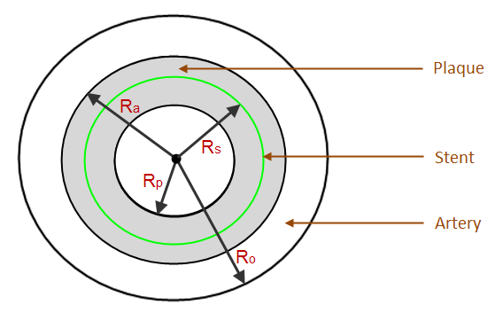

Cardiovascular Stent Simulation
===============================

This example problem shows how to simulate stent-artery interaction during and after stent
placement in an occluded artery.
The analysis exposes advanced modeling techniques using PyMAPDL such as:
* Contact
* Element birth and death
* Mixed u-P formulation
* Nonlinear stabilization

This example is inspired from the model and analysis defined in Chapter 25 of the `Mechanical
APDL Technology Showcase Manual <tech_demo_intro_>`_.

Introduction
------------

A bare metal stent is an effective device for opening atherosclerotic arteries and
other blockages:

.. figure:: images/gtecstent1.png
    :align: center
    :alt: Effect of Stent Placement in Increasing Blood FlowCourtesy of Lakeview Center
    :figclass: align-center
    
    **Figure 25.1: Effect of Stent Placement in Increasing Blood Flow**
    Courtesy of `LakeviewCenter <http://www.elakeviewcenter.org>`

The success of stenting depends largely on how the stent and the artery interact
mechanically. In both the stent-design process and in pre-clinical patient-specific
evaluations, computer simulation using finite element analysis (FEA) has become an
accepted tool for studying stent-artery interaction. 

A viable stent-artery finite element model must properly reflect the nonlinear nature
of the phenomenon, such as the biological tissue properties, large arterial wall
deformation, and the sliding contact between the stent and the artery wall.

Starting MAPDL as a service
---------------------------

.. code:: ipython3

    # starting MAPDL as a service and importing an external model
    from ansys.mapdl.core import launch_mapdl
    # start MAPDL as a service
    mapdl = launch_mapdl()
    print(mapdl)

Setting up the model
--------------------

First, we define the material properties. 

.. code:: ipython3

    # define 316L Stainless steel
    mapdl.prep7()
    mapdl.mptemp()
    mapdl.mptemp(sloc="1", t1="0")
    mapdl.mpdata(lab="EX", mat="1", c1="200e3")
    mapdl.mpdata(lab="PRXY", mat="1", c1="0.3")
    mapdl.mptemp()
    mapdl.mptemp(sloc="1", t1="0")
    mapdl.mpdata(lab="DENS", mat="1", c1="8000e-9")

Then, we can define the element technology_showcase_examples.

.. code:: ipython3

    # for straight line segments
    mapdl.et(itype="1", ename="beam189")
    mapdl.sectype(secid="1", type_="beam", subtype="csolid")
    mapdl.secdata(val1=0.05)

    # for arcs
    mapdl.et(itype="2", ename="beam189")
    mapdl.sectype(secid="2", type_="beam", subtype="csolid")
    mapdl.secdata(val1=0.05)

We define the 5-parameter Mooney-Rivlin hyperelastic artery material
model.

.. code:: ipython3

    c10 = 18.90e-3
    c01 = 2.75e-3
    c20 = 590.43e-3
    c11 = 857.2e-3
    nu1 = 0.49
    dd = 2 * (1 - 2 * nu1) / (c10 + c01)

    mapdl.tb(lab="hyper", mat="2", npts="5", tbopt="mooney")
mapdl.tbdata(stloc="1", c1="c10", c2="c01", c3="c20", c4="c11", c6="dd")

We define the linear elastic material model for stiff calcified plaque.

.. code:: ipython3

    mapdl.mp(lab="EX", mat="3", c0=".00219e3")
    mapdl.mp(lab="NUXY", mat="3", c0="0.49")

We define the Solid185 element type to mesh both the artery and plaque.

.. code:: ipython3

    # for artery
    mapdl.et(itype="9", ename="SOLID185")
    mapdl.keyopt(
        itype="9", knum="6", value="1")  # Use mixed u-P formulation to avoid locking
    mapdl.keyopt(itype="9", knum="2", value="3")  # Use Simplified Enhanced Strain method

    # for plaque
    mapdl.et(itype="16", ename="SOLID185")
    mapdl.keyopt(itype="16", knum="2", value="0")  # Use B-bar

We define the settings to model the stent, the artery and the plaque.

We use force-distributed boundary constraints on 2 sides of artery wall to allow
for radial expansion of tissue without rigid body motion.

Settings for MPC Surface-based, force-distributed contact on proximal plane
parallel to x-y plane

.. code:: ipython3

    mapdl.mat("2")
    mapdl.r(nset="3")
    mapdl.real(nset="3")
    mapdl.et(itype="3", ename="170")
    mapdl.et(itype="4", ename="174")
    mapdl.keyopt(itype="4", knum="12", value="5")
    mapdl.keyopt(itype="4", knum="4", value="1")
    mapdl.keyopt(itype="4", knum="2", value="2")
    mapdl.keyopt(itype="3", knum="2", value="1")
    mapdl.keyopt(itype="3", knum="4", value="111111")
    mapdl.type(itype="3")

    mapdl.mat("2")
    mapdl.r(nset="4")
    mapdl.real(nset="4")
    mapdl.et(itype="5", ename="170")
    mapdl.et(itype="6", ename="174")
    mapdl.keyopt(itype="6", knum="12", value="5")
    mapdl.keyopt(itype="6", knum="4", value="1")
    mapdl.keyopt(itype="6", knum="2", value="2")
    mapdl.keyopt(itype="5", knum="2", value="1")
    mapdl.keyopt(itype="5", knum="4", value="111111")
    mapdl.type(itype="5")

Settings for standard contact between stent and inner plaque wall contact
surface

.. code:: ipython3

    mapdl.mp(lab="MU", mat="1", c0="0")
    mapdl.mat("1")
    mapdl.mp(lab="EMIS", mat="1", c0="7.88860905221e-31")
    mapdl.r(nset="6")
    mapdl.real(nset="6")
    mapdl.et(itype="10", ename="170")
    mapdl.et(itype="11", ename="177")
    mapdl.r(nset="6", r3="1.0", r4="1.0", r5="0")
    mapdl.rmore(r9="1.0E20", r10="0.0", r11="1.0")
    mapdl.rmore(r7="0.0", r8="0", r9="1.0", r10="0.05", r11="1.0", r12="0.5")
    mapdl.rmore(r7="0", r8="1.0", r9="1.0", r10="0.0")
    mapdl.keyopt(itype="11", knum="5", value="0")
    mapdl.keyopt(itype="11", knum="7", value="1")
    mapdl.keyopt(itype="11", knum="8", value="0")
    mapdl.keyopt(itype="11", knum="9", value="0")
    mapdl.keyopt(itype="11", knum="10", value="2")
    mapdl.keyopt(itype="11", knum="11", value="0")
    mapdl.keyopt(itype="11", knum="12", value="0")
    mapdl.keyopt(itype="11", knum="2", value="3")
    mapdl.keyopt(itype="10", knum="5", value="0")

Settings for MPC based, force-distributed constraint on proximal stent nodes

.. code:: ipython3

    mapdl.mat("1")
    mapdl.r(nset="7")
    mapdl.real(nset="7")
    mapdl.et(itype="12", ename="170")
    mapdl.et(itype="13", ename="175")
    mapdl.keyopt(itype="13", knum="12", value="5")
    mapdl.keyopt(itype="13", knum="4", value="1")
    mapdl.keyopt(itype="13", knum="2", value="2")
    mapdl.keyopt(itype="12", knum="2", value="1")
    mapdl.keyopt(itype="12", knum="4", value="111111")
    mapdl.type(itype="12")

Settings for MPC based, force-distributed constraint on distal stent
nodes.

.. code:: ipython3

    mapdl.mat("1")
    mapdl.r(nset="8")
    mapdl.real(nset="8")
    mapdl.et(itype="14", ename="170")
    mapdl.et(itype="15", ename="175")
    mapdl.keyopt(itype="15", knum="12", value="5")
    mapdl.keyopt(itype="15", knum="4", value="1")
    mapdl.keyopt(itype="15", knum="2", value="2")
    mapdl.keyopt(itype="14", knum="2", value="1")
    mapdl.keyopt(itype="14", knum="4", value="111111")
    mapdl.type(itype="14")

Once all the setups are ready, we read the geometry file.

.. code:: ipython3

    mapdl.cdread(option="db", fname="stent", ext="cdb")
    mapdl.allsel(labt="all")
    mapdl.finish()

Static Analysis
---------------

We, then, the static analysis.

.. code:: ipython3

    # enter solution processor and define analysis settings
    mapdl.run("/solu")
    mapdl.antype(antype="0")
    mapdl.nlgeom(key="on")

We apply the Load Step 1:
Balloon angioplasty of the artery to expand it past the
radius of the stent - IGNORE STENT

.. code:: ipython3

    mapdl.nsubst(nsbstp="20", nsbmx="20")
    mapdl.nropt(option1="full")
    mapdl.cncheck(option="auto")
    mapdl.esel(type_="s", item="type", vmin="11")
    mapdl.cm(cname="contact2", entity="elem")
    mapdl.ekill(elem="contact2")  # Kill contact elements in stent-plaque contact 
                                  #pair so that the stent is ignored in the first loadstep
    mapdl.nsel(type_="s", item="loc", comp="x", vmin="0", vmax="0.01e-3")
    mapdl.nsel(type_="r", item="loc", comp="y", vmin="0", vmax="0.01e-3")
    mapdl.d(node="all", lab="all")
    mapdl.allsel()

    mapdl.sf(nlist="load", lab="pres", value="10e-2")  # Apply 0.1 Pa/mm^2 pressure to inner plaque wall
    mapdl.allsel()
    mapdl.nldiag(label="cont", key="iter")
    mapdl.solve()
    mapdl.save()

We then apply the Load Step 2: Reactivate contact between stent and plaque.

.. code:: ipython3

    mapdl.ealive(elem="contact2")
    mapdl.allsel()

    mapdl.nsubst(nsbstp="2", nsbmx="2")
    mapdl.save()
    mapdl.solve()

We apply the Load Step 3.

.. code:: ipython3

    mapdl.nsubst(nsbstp="1", nsbmx="1", nsbmn="1")
    mapdl.solve()

We apply the Load Step 4: Apply blood pressure (13.3 kPa) load to
inner wall of plaque and allow the stent to act as a scaffold.

.. code:: ipython3

    mapdl.nsubst(nsbstp="300", nsbmx="3000", nsbmn="30")
    mapdl.sf(nlist="load", lab="pres", value="13.3e-3")
    mapdl.allsel()

Finally, we apply stabilization with energy option.

.. code:: ipython3

    mapdl.stabilize(key="const", method="energy", value="0.1")

25.2. Problem Description
-------------------------

A `Medtronic <http://www.medtronic.com/>` Driver® (formerly S7) coronary stent
and a severely occluded coronary artery are modeled.

The artery is simplified as a two-layered straight cylinder, with one layer
representing the artery wall and the other representing the calcified plaque. 

The following figure shows the general dimensions of the artery and stent:

> 
> 
> | Ra (inner artery radius) = 2.1 mm |
> | Rs (stent radius) = 1.75 mm |
> | Rp (inner plaque radius) = 1.6 mm |
> | Ro (outer artery radius) = 2.6 mm |
> 
>
    :figclass: align-center
    
    **Figure 25.2: Cross-sectional View of Unloaded Artery and Stent**

A nonlinear static analysis is performed to simulate the three-step stenting
procedure:

#. Expand the artery using elevated pressure (balloon angioplasty).
#. Place the stent.
#. Contract the artery using mean blood pressure and creating contact between
   the stent and the artery wall.

25.3. Modeling
--------------

Cardiovascular stent modeling involves three components:

* `25.3.1. Stent Modeling`_

* `25.3.2. Artery and Plaque Modeling`_

* `25.3.3. Stent-Plaque Contact Modeling`_

25.3.1. Stent Modeling
----------------------

A line model of the stent is created and then meshed with 1,760 BEAM189 beam
elements, as shown in the following figure:

    
    **Figure 25.3: Stent Model 3-D Expanded Solid Display**

For modeling simplicity and computational efficiency, beam elements are preferred
over solid elements. 

The stent assembly has a 3.5 mm diameter, a 15 mm length, and 8 crowns. The wire
for constructing the stent has a circular cross-section with an outer diameter of
0.1 mm. 

Although Nitinol material is commonly used for the stent, the nonlinear material
behavior of Nitinol requires a separate discussion. For the purposes of this
problem, therefore, the model uses linear elastic 316L steel instead.

25.3.2. Artery and Plaque Modeling
----------------------------------

The simplified two-layer artery and plaque model is meshed with 3-D solid
elements, as shown in this figure: 

.. figure:: graphics/gtecstent4.png
    :align: center
    :alt: Simplified Atherosclerotic Artery Model
    :figclass: align-center
    
    **Figure 25.4: Simplified Atherosclerotic Artery Model**

The artery layer is meshed with 9,000 SOLID185 layered
structural solid elements with the simplified enhanced strain formulation (KEYOPT(2)
= 3). Mixed u-P formulation (KEYOPT(6) = 1) is used to overcome the volumetric
locking typically associated with incompressible biological tissue. 

The plaque layer is also meshed with 9,000 SOLID185
elements. Full integration with the 

.. image:: graphics/eq3396db3e-75fc-4169-9bdf-6efc626a19f3.svg
    :align: center
    :alt: 

 method is used for the plaque elements, as the material of the
calcified plaque is considered to be linear elastic. 

A coincident mesh is created at the artery-plaque interface to enforce a secure
bond between the artery and the plaque.

Based on St. Venant’s principle, both the artery and plaque are extended by
3 mm to reduce end effects. Fine elements are used near the two ends to mitigate any
convergence difficulty caused by large localized deformation.

25.3.3. Stent-Plaque Contact Modeling
-------------------------------------

Contact between the inner plaque wall and stent from arterial contraction is
modeled as line-to-surface contact. 

The stent lines are meshed with CONTA177 contact
elements. 

A Lagrangian multiplier method on contact normals and penalty tangent method on
target normals is used (KEYOPT(2) = 3), along with automatic bisection (KEYOPT(7) =
1) and standard contact behavior (KEYOPT(12) = 0). 

The inner plaque wall surface is meshed with TARGE170
target elements. Zero-friction behavior is assumed.(tecstentrefs.html#tecstent_cit1)]

The following figure illustrates the stent-plaque contact:

    
    **Figure 25.5: Standard Line-to-Surface Contact Between Stent and Inner Plaque Wall**

25.4. Material Properties
-------------------------

`Material properties <ref1_>`_ for the stent, artery, and plaque are as follows: 

+----------+--------------------+----------------------------------------------------+
|          | **Linear Elastic** |    **`Mooney-Rivlin <td_mr_>`_ Hyperelastic**      |
+==========+====================+====================================================+
|          |  **EX**   |**PRXY**|   **C10**   |  **C01**   |  **C20**   |  **C11**   |
|          |**(N/mm2)**|        | **(N/mm2)** |**(N/mm2)** |**(N/mm2)** |**(N/mm2)** |
+----------+-----------+--------+----------------------------------------------------+
|**Stent** |  2.00E+05 |   0.3  |                                                    |
+----------+-----------+--------+----------------------------------------------------+
|**Artery**|                    |   1.89E-02  | 2.75E-03   |  5.90E-01  |  8.57E-01  |
+----------+-----------+--------+----------------------------------------------------+                                                    |
|**Plaque**|   2.19    | 0.49   |                                                    |
+----------+-----------+--------+----------------------------------------------------+

25.5. Boundary Conditions and Loading
-------------------------------------

The following topics concerning boundary conditions and loading for the
cardiovascular stent simulation are available:

*  `25.5.1. Artery Boundary Conditions`_
*  `25.5.2. Stent Boundary Conditions`_
*  `25.5.3. Plaque Wall Loading`_

25.5.1. Artery Boundary Conditions
----------------------------------

A multipoint constraint(MPC), force-distributed constraint is applied to the proximal and
distal surfaces of the artery by specifying KEYOPT (2) = 2, KEYOPT(4) = 1 and
KEYOPT(12) = 5 for the CONTA174 elements, as shown in the
following figure:

    
    **Figure 25.6: Artery Boundary Conditions**

MPC pilot nodes (TARGE170) are fixed in all six degrees
of freedom. The boundary conditions allow for radial arterial expansion, while
adequately preventing rigid body motion of the artery.

25.5.2. Stent Boundary Conditions
---------------------------------

As with the artery, an MPC-based, force-distributed constraint is applied to
selected nodes on the proximal and distal ends of the stent
(CONTA175), as shown in this figure:

    
    **Figure 25.7: Stent Boundary Conditions**

MPC pilot nodes (TARGE170) are fixed in all six degrees
of freedom. 

25.5.3. Plaque Wall Loading
^^^^^^^^^^^^^^^^^^^^^^^^^^^

Surface pressure loads are applied to all nodes on the inner plaque wall,
representing the balloon expansion pressure in the first load step (0.1
N/mm2) and blood pressure in the fourth load step
(0.0133 N/mm2). 

The following figure illustrates the load surface and load history:

**Figure 25.8: Uniform Pressure Loading on the Inner Plaque Wall (a)**
**and Load History (b)**

.. image:: gtecstent7a.png
    :width: 45 %
.. image:: gtecstent7b.png
    :width: 45 %

25.6. Analysis and Solution Controls
------------------------------------

A nonlinear static analysis (ANTYPE,STATIC) with large-deflection
effects (NLGEOM,ON) is specified. Contact parameters are optimized
(CNCHECK,AUTO) to achieve better convergence based on overall
contact-pair behaviors.

**Load Step 1**

During the first load step, an elevated blood pressure of 0.1
N/mm2 is applied to the inner surface of the plaque wall
to cause sufficient radial wall expansion for subsequent stent placement. 

Stent contact elements (CONTA177) are killed (EKILL) to remove the effects
of the stent.

This load step uses a maximum of 20 substeps with 20 initial substeps
(NSUBST,20,20). 

The following figure shows the effects of the first load step:

    
    **Figure 25.9: Cross-Sectional View of Artery and Stent After Balloon Angioplasty (Load Step 1)**

**Load Steps 2 and 3**
Load steps 2 and 3 use three total substeps to allow the Newton-Raphson residuals (from the nonlinear
expansion in load step 1) to equilibrate after the stent contact elements are
reactivated ([**EALIVE**]).
**Load Step 4**
In the fourth load step, blood pressure is ramped to a magnitude of 0.0133
N/mm2, which represents the mean arterial blood pressure
(100 mmHg). 

Under this reduced load, the atherosclerotic artery collapses onto the stent scaffold. 

This load step uses 200 initial substeps, 2000 maximum substeps, and 20 minimum
substeps to obtain contact convergence ([**NSUBST**],200,2000,20). 
Nonlinear stabilization
([**STABILIZE**],CONST,ENERGY,0.1) helps to achieve solution
convergence during this load step.

25.7. Results and Discussion
----------------------------

Proper element technologies and solution options allow a successful nonlinear
simulation of stent-artery interaction. The analysis generates detailed information
about the post-insertion artery wall deformation, wall stresses, and stent
retraction.

The positive effect of stenting is evident in the following figure, which shows the
artery wall configurations before and after stent placement:

**Figure 25.10: Arterial Wall Deformation During Balloon Angioplasty (a) and**
**After Stent Placement (b)**

| Arterial Wall Deformation During Balloon Angioplasty (a) and After Stent Placement (b) | Arterial Wall Deformation During Balloon Angioplasty (a) and After Stent Placement (b) |
| (a) | (b) |

The following figure clearly shows the expected tissue prolapse (tissue extension into
the gaps in the stent):

    
    **Figure 25.11: Arterial Wall Displacement and Tissue Prolapse Results**

This figure shows the detailed stress distribution on the inner artery wall, with an
expected pattern matching the stent geometry: 

.. figure:: graphics/gtecstent11.png
    :align: center
    :alt: Arterial Wall von Mises Stress Results
    :figclass: align-center
    
    **Figure 25.12: Arterial Wall von Mises Stress Results**

Finally, the stent retraction under compressive load from the occluded artery wall is
shown in this figure:

    
    **Figure 25.13: Stent Retraction Resulting from Arterial Compression**

The simulation results agree well with those in the published literature.(tecstentrefs.html#tecstent_cit1)]

FEA-based simulation is capable of quickly generating accurate and detailed
information about stent-artery interaction. Finite element modeling is being used not
only to develop state-of-the-art stent innovations, but also for pre-clinical
patient-specific assessment and customization. 

25.8. Recommendations
---------------------

To perform a similar stent-artery interaction analysis, consider the following hints
and recommendations:

* Compared to surface-to-surface contact with a full solid model, line-to-surface contact can provide
  similar results using significantly less solution time.
* Multipoint constraints (MPCs) provide
  biologically accurate boundary conditions.
* The choice of units is critical for avoiding numerical difficulties. For
  biological problems, millimeters-micron units are preferred.
* To achieve faster solutions, coincident nodes and surfaces are preferred over
  bonded contact.
* Stabilization mitigates convergence
  issues in unstable nonlinear problems.

25.9. References
----------------

The following reference work is cited in this example problem:

.. _ref1: 

Lally, C., Dolan, F, & Pendergrast, P. J. (2005). (http://www.jbiomech.com/article/S0021-9290(04)00375-6/abstract). *Journal of Biomechanics.* 38:
1574-1581.

25.10. Input Files
------------------

The following files were used in this problem:

* **stent.dat** -- Input file for the cardiovascular stent
  problem.
* **stent.cdb** -- The common database file containing the model
  information for this problem (called by **stent.dat**).

+-----------------------------------------------------------------------------------------------------------------------------------+
| [Download the zipped **td-25** file set for thisproblem](https://storage.ansys.com/doclinks/techdemos.html?code=td-25-DLU-N2a).   |
+===================================================================================================================================+
| For more information, see [Obtaining the Input  Files](tecintro.html "Obtaining the Input                     Files").            |
+-----------------------------------------------------------------------------------------------------------------------------------+
