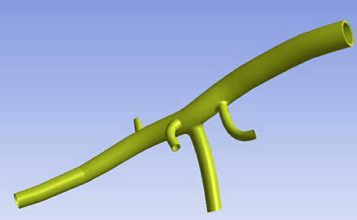

.. _sphx_glr_ex_62-techinverse.rst:

.. _tech_demo_62:

Inverse-Solving Analysis of a Cardiovascular Structure
======================================================

This example problem demonstrates the capabilities and advantages
of using a nonlinear static analysis with inverse solving to
investigate the biomechanics of a cardiovascular system.

The following topics are available:

*  `1. Introduction`_
*  `2. Setting up the model`_
*  `3. Analysis`_
*  `4. Results`_
*  `5. Exit MAPDL`_
*  `6. Recommendations`_
*  `7. References`_
*  `8. Input files`_

This example is inspired from the model and analysis defined in Chapter 62
of the `Mechanical APDL Technology Showcase Manual <mapdl_tech_show_>`_.

1. Introduction
---------------

Finite element models of cardiovascular system components (such as the heart
valve or blood vessels) are based on in vivo organ geometries obtained from
3D imaging systems such as computed tomography (CT) or magnetic resonance imaging (MRI).

Although medical imaging techniques offer accurate in vivo visualization of 3D
patient-specific geometries, the geometries are under a loaded state
(for example, in the presence of blood pressure) and lack in vivo stress/strain
field information. Therefore, a nonlinear analysis performed directly on the
geometry to simulate additional loading leads to inaccurate results.

In such cases, an inverse-solving analysis uses input geometry consisting of
images where the models are already in a deformed shape under applied loads.
The material properties and applied loads are known. The analysis can then
determine the following:

 - The organ geometries at zero-pressure state (zero-pressure configuration)

 - The stress and strain fields on the in vivo organ geometries (the input geometries)

 - The behavior and response of the organ geometries when increasing the
   loading and taking accounting for prestressed effects

1.1. Problem description
^^^^^^^^^^^^^^^^^^^^^^^^

A mouse-specific 3D geometry of the aortic lumen containing four side branches
is considered:

The model represents an approximated geometry of the abdominal aorta of a mouse,
based on the reference.[1] The geometry is considered at end-diastolic pressure (80 mm Hg).
The purpose of the analysis is to solve for end-systolic pressure (120 mm Hg).

This figure shows the inner diameter of the model at various approximate locations:

.. figure:: images/glr_tse_aorta2.png
    :align: center
    :alt: Dimensions of Each Branch in the Abdominal Aorta Model
    :figclass: align-center

The wall thickness is assumed to be 20 percent of the local radius, so it varies
throughout the structure.

1.2. Starting MAPDL as a service
^^^^^^^^^^^^^^^^^^^^^^^^^^^^^^^^

.. code:: python

   # starting MAPDL as a service and importing an external model
   from ansys.mapdl.core import launch_mapdl
   from ansys.mapdl.core.examples.downloads import download_tech_demo_data
   
   # start MAPDL as a service
   mapdl = launch_mapdl(loglevel="WARNING", print_com=True)
   print(mapdl)

 .. code-block:: none

    Mapdl
    -----
    PyMAPDL Version:     0.70.2
    Interface:           grpc
    Product:             Ansys Mechanical Enterprise
    MAPDL Version:       25.1
    Running on:          localhost
                         (127.0.0.1)

2. Setting up the model
-----------------------

The model is meshed mostly with the higher-order hexahedral SOLID186
elements (about 99.4 percent of the total mesh), as shown in
the following figure. However, it also has relatively a small number
of tetrahedral SOLID187 elements (about 0.6 percent of the total mesh).

The mesh consists of 62123 elements with 4 elements to represent the wall
thickness and at least 52 elements (or more) in the circumferential
direction at most locations. Mixed u-P element formulation is enabled (KEYOPT(6) = 1).

Starting MAPDL as a service and importing an external model
~~~~~~~~~~~~~~~~~~~~~~~~~~~~~~~~~~~~~~~~~~~~~~~~~~~~~~~~~~~

.. code-block:: python

    # Download the CDB file of aortic lumen.
    aorta_mesh_file = download_tech_demo_data(
        "td-62", "inverse_analysis_cardiovascular_structure.cdb"
    )

    # Entering the PREP7 processor in MAPDL instance.
    mapdl.prep7()

    # Reads a CDB file of solid model and database information into the database.
    mapdl.cdread("comb", fname = aorta_mesh_file)

    # Selects all entities with a single command.
    mapdl.allsel("all", "all")

    # Element plot of the Abdominal Aorta Model
    mapdl.eplot(background='w')

    # Exits from a pre-processor.
    mapdl.finish()

2.1. Material properties
^^^^^^^^^^^^^^^^^^^^^^^^

A Mooney-Rivlin hyperelastic material model with the following constants [4] is
used to model the abdominal aorta:

2.2. Boundary Conditions and Loading
^^^^^^^^^^^^^^^^^^^^^^^^^^^^^^^^^^^^

The free radial boundary conditions are applied at each end cross-section in the model:

.. figure:: images/glr_tse_aorta5.png
    :align: center
    :alt: Boundary Conditions on the Abdominal Aorta Model
    :figclass: align-center

Local cylindrical coordinate systems are created at each end cross-section. The nodes
in each end cross-section are constrained in all degrees of freedom except for the
respective local radial direction.

A uniformly-distributed pressure load is applied on the inner surfaces of the model.

Because the input geometry is considered at end-diastolic pressure, a pressure load of
80 mm Hg (1.0666e-02 MPa) is applied on the inner surfaces of the model in the first
load step (inverse-solving). The pressure is increased to 120 mm Hg (1.5999e-02 MPa)
in the second load step (forward-solving).

3. Analysis
-----------

The analysis for this problem is performed in two load steps:

3.1. Load Step 1 (Inverse-Solving)
^^^^^^^^^^^^^^^^^^^^^^^^^^^^^^^^^^

Load Step 1 (Inverse-Solving) - A nonlinear static analysis with inverse solving (INVOPT,ON)
is performed on the input geometry of the model (at end-diastolic pressure (80 mm Hg)) to
determine the zero-pressure geometry of the model and to obtain the stress/strain results
on the input geometry.

.. code:: python

    # Enter solution processor and specify solution controls.
    mapdl.slashsolu()
    # Define the analysis type as static.
    mapdl.antype(0)
    # Turn on large deflection effects.
    mapdl.nlgeom("on")
    # Define "Sparse" solver option.
    mapdl.eqslv("sparse", keepfile="1")

    mapdl.cntr("print", 1)          # Print convergence control information
    mapdl.dmpoption("emat", "no")   # Don't combine emat file for DANSYS
    mapdl.dmpoption("esav", "no")   # Don't combine esav file for DANSYS

    # Turn on "Inverse-Solving" option for Initial Steps.
    mapdl.run("invopt,on")

    # Controls file writing for multiframe restarts.
    mapdl.nldiag("cont", "iter")    
    mapdl.rescontrol("define", "last", "last", "", "dele") 

    # Specify surface "pressures" loads.
    mapdl.esel("u", "ename", "", 153, 156)
    mapdl.sf("_CM968PRES", "pres", "%_loadvari968 %")
    mapdl.esel("all")
    mapdl.nopr()
    mapdl.gopr()

    # Turned on automatic time stepping.
    mapdl.autots("on")

    # Specifies the number of substeps to be taken this load step.
    # Note: Please be aware that the number of substeps is decreased to reduce the computational effort.
    #mapdl.nsubst(nsbstp='10', nsbmx='1000', nsbmn='5', carry="OFF")
    mapdl.nsubst(nsbstp='2', nsbmx='2', nsbmn='2', carry="OFF")

    # Sets the time for a first load step.
    mapdl.time(time='1.0')

    # Controls the solution data written to the database.
    mapdl.outres("erase")
    mapdl.outres("all", "none")
    mapdl.outres("nsol", "all")
    mapdl.outres("rsol", "all")
    mapdl.outres("eangl", "all")
    mapdl.outres("etmp", "all")
    mapdl.outres("veng", "all")
    mapdl.outres("strs", "all")
    mapdl.outres("epel", "all")
    mapdl.outres("eppl", "all")
    mapdl.outres("cont", "all")

    # Solve the load step 1 (inverse-solving).
    mapdl.solve()

3.2. Load Step 2 (Forward-Solving)
^^^^^^^^^^^^^^^^^^^^^^^^^^^^^^^^^^

After an inverse-solving load step, the solver generally allows an analysis to continue
as forward-solving in a new load step. You can modify existing loads or apply new loads
in the forward-solving step. For more information, see `Reverting to Forward Solving and
Continuing the Analysis as a New Load Step in the Structural Analysis Guide`_.

Load Step 2 (Forward-Solving) - To solve the model for end-systolic pressure (120 mm Hg),
the solution continues using forward solving (INVOPT,OFF). The pressure load is increased
from 80 mm Hg to 120 mm Hg. Continuing the solution as a new load step following the
inverse-solving load step eliminates a step in the simulation, allowing for a more
efficient analysis.

.. code-block:: python

    # Solution Control for the load step 2 (forward-solving).

    # Turned on automatic time stepping.
    mapdl.autots("on")

    # Specifies the number of substeps to be taken this load step.
    # Note: Please be aware that the number of substeps is decreased to reduce the computational effort.
    #mapdl.nsubst(nsbstp='10', nsbmx='1000', nsbmn='5', carry="OFF")
    mapdl.nsubst(nsbstp='2', nsbmx='2', nsbmn='2', carry="OFF")

    # Sets the time for the second load step.
    mapdl.time(time='2.0')

    # Turn off "Inverse-Solving" option for the second steps.
    mapdl.run("invopt,off")

    # Controls the solution data written to the database.
    mapdl.outres("erase")
    mapdl.outres("all", "none")
    mapdl.outres("nsol", "all")
    mapdl.outres("rsol", "all")
    mapdl.outres("eangl", "all")
    mapdl.outres("etmp", "all")
    mapdl.outres("veng", "all")
    mapdl.outres("strs", "all")
    mapdl.outres("epel", "all")
    mapdl.outres("eppl", "all")
    mapdl.outres("cont", "all")

    # Solve the load step 2 (forward-solving).
    mapdl.solve()

    # Exits from a solution processor.
    mapdl.finish()

4. Results
----------

The results of the analysis are obtained in two load steps:

.. code-block:: python

    # Enter post-processor to compute results quantities.
    mapdl.post1()

    # Settings for reverse video plot
    mapdl.rgb("index", 100, 100, 100, 0)
    mapdl.rgb("index", 80, 80, 80, 13)
    mapdl.rgb("index", 60, 60, 60, 14)
    mapdl.rgb("index", 0, 0, 0, 15)

    # Defines the type of graphics display. Activate "Power" graphics.
    mapdl.graphics("power")

4.1. Load Step 1 (Inverse-Solving)
^^^^^^^^^^^^^^^^^^^^^^^^^^^^^^^^^^

The deformed shape of the abdominal aorta model after the first load step
is the zero-pressure geometry:

.. code-block:: python

    # Defines the data set to be read from the results file.
    mapdl.set(lstep = '1')
    mapdl.show("png","rev")

    # Total Deformation (USUM) After Inverse Solving (First Load Step)
    mapdl.plnsol("u", "sum", 1, 1)
    mapdl.get("max_usum_first_loadstep", "plnsol", 0, "max")

.. figure:: images/inverse_analysis_cardiovascular_structure000.png
    :align: center
    :alt: Total Deformation (USUM) After Inverse Solving (First Load Step)
    :figclass: align-center

In addition to the zero-pressure geometry, the inverse-solving load step also
gives the stress/strain results of the input geometry at end-diastolic pressure (80 mm Hg):

.. code-block:: python

    # Maximum Principal Stress After Inverse Solving (First Load Step)
    mapdl.plnsol("s", 1)
    mapdl.get("max_s1_first_loadstep", "plnsol", 0, "max")

    # Maximum Principal Strain After Inverse Solving (First Load Step)
    mapdl.plnsol("epel", 1)
    mapdl.get("max_epel1_first_loadstep", "plnsol", 0, "max")

    mapdl.show("close")

4.2. Load Step 2 (Forward-Solving)
^^^^^^^^^^^^^^^^^^^^^^^^^^^^^^^^^^

In the second load step, the analysis is continued via forward solving (INVOPT,OFF)
and the pressure load is increased until it reaches end-systolic pressure (120 mm Hg):

.. code-block:: python

    # Defines the data set to be read from the results file.
    mapdl.set(lstep = 'last')
    mapdl.show("png","rev")

    # Total Deformation (USUM) After Forward Solving (Second Load Step)
    mapdl.plnsol("u", "sum", 1, 1)
    mapdl.get("max_usum_second_loadstep", "plnsol", 0, "max")

    # Maximum Principal Stress After Forward Solving (Second Load Step)
    mapdl.plnsol("s", 1)
    mapdl.get("max_s1_second_loadstep", "plnsol", 0, "max")

    # Maximum Principal Strain Plot of the Abdominal Aorta Model at End-Systolic Pressure (120 mm Hg)
    mapdl.plnsol("epel", 1)
    mapdl.get("max_epel1_second_loadstep", "plnsol", 0, "max")
    mapdl.show("close")

.. figure:: images/inverse_analysis_cardiovascular_structure003.png
    :align: center
    :alt: Total Deformation (USUM) After Forward Solving (Second Load Step)
    :figclass: align-center

For comparison purposes only, the following figure shows one of the cross-sections in the proximal abdominal
aorta at zero-pressure, end-diastolic pressure, and end-systolic pressure conditions:

.. figure:: images/glr_tse_aorta7.png
    :align: center
    :alt: Deformation of Cross-Section at the Proximal Abdominal Aorta Location for Various Pressure Conditions
    :figclass: align-center

The input geometry is considered at end-diastolic pressure (80 mm Hg), the deformed geometry
after the first load step (inverse solving) is at zero-pressure, and the deformed geometry after
the second load step is at end-systolic pressure (120 mm Hg). The outer diameters of the cross-section
in deformed states are approximately calculated by creating a local cylindrical coordinate system
at the approximate center of the deformed cross-section.

When using the inverse-solving method to account for the input geometry at end-diastolic pressure (80 mm Hg)
and prestress effects, the actual maximum total deformation is much lower.

5. Exit MAPDL
-------------

.. code:: python

   mapdl.exit()

6. Recommendations
------------------

When performing a similar type of analysis using inverse-solving, consider the following:

 - Use a structured mesh with a sufficient number of element layers in the thickness direction.

   Doing so captures results more accurately, as a free mesh may give lesser-quality tetrahedral
   and/or pyramid elements, leading to spurious high-stress concentrations at some locations.

 - Perform a loop test to verify the results of an inverse-solving analysis.

   An inverse-solving analysis followed by a forward-solving analysis, or vice versa,
   is known as a loop test, as it should always result in the same geometry with the same solution.

 - Use a reversed sign to apply displacement type loading in the inverse-solving load step.

   For more information, see `Applying Loads in an Inverse-Solving Analysis in the Structural Analysis Guide`_.

7. References
-------------

The following reference works are cited in, or were consulted when creating, this example problem:

 - Bols, J., Degroote, J., Trachet, B., Verhegghe, B., Segers, P., & Vierendeels, J. (2013).
   A computational method to assess the in vivo stresses and unloaded configuration of
   patient-specific blood vessels. Journal of Computational and Applied Mathematics. 246: 10-17.

 - Trachet, B., Renard, M., DeSantis, G., Staelens, S., DeBacker, J., Antiga, L., Loeys,
   B., & Segers, P. (2011). An integrated framework to quantitatively link mouse-specific
   hemodynamics to aneurysm formation in angiotensin II-infused ApoE -/- mice. Annals of
   Biomedical Engineering. 39: 2430-2444.

 - Trachet, B., Bols, J., Degroote, J., Verhegghe, B., Stergiopulos, N., Vierendeels, J., &
   Segers, P. (2015). An animal-specific FSI model of the abdominal aorta in anesthetized
   mice. Annals of Biomedical Engineering. 43: 1298-1309.

 - Prendergast, P.J., Lally, C., Daly, S., Reid, A. J., Lee, T. C., Quinn, D., & Dolan,
   F. (2003). Analysis of prolapse in cardiovascular stents: a constitutive equation for
   vascular tissue and finite-element modelling. Journal of Biomechanical Engineering. 125(5): 692-699.

8. Input files
--------------

The following files were used in this problem:

* **Inverse_Analysis_Cardiovascular_Structure.dat** -- Input file for this example problem.

* **Comparison_Case.dat** -- Input file for the comparison case.

+-----------------------------------------------------------------------------------------------------------------------------------+
| `Download the zipped td-62 file set for this problem <https://storage.ansys.com/doclinks/techdemos.html?code=td-62-DLU-N2a>`_     |
+-----------------------------------------------------------------------------------------------------------------------------------+

For more information, see `Obtaining the input files <examples_intro_>`_.

.. only:: html

 .. rst-class:: sphx-glr-signature

    `Gallery generated by Sphinx-Gallery <https://sphinx-gallery.github.io>`_
